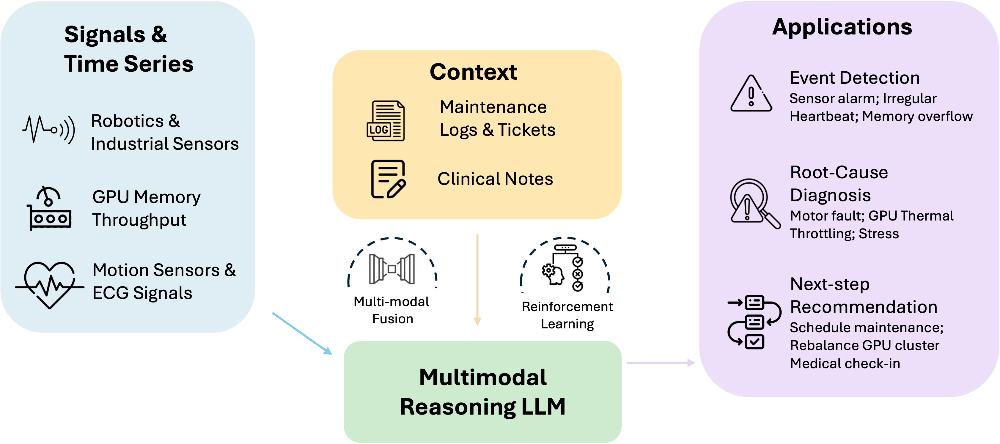

I am a Ph.D. Candidate in Statistics at Penn State. This summer, building on my work from last summer, I will again join Amazon DST & AWS AI as an Applied Scientist intern, focusing on large language and vision-language models for time-series reasoning, working with [Boran Han](https://boranhan.github.io/) and [Matthew Reimherr](https://mreimherr.github.io/). I am advised by Dr. [Runze Li](https://runzelipsu.github.io/) and in collaboration with Dr. [Ying Sun](https://ysunac.github.io/) from the EECS department, where we develop transfer-learning and meta-learning methods for modeling large-scale, crowd-sourced datasets.

<figure>
  
  <figcaption>Signals & Time Series Understanding and Reasoning.</figcaption>
</figure>

## Publications and Preprints
- Harnessing Vision-Language Models for Time Series Anomaly Detection (2025+) [[Paper](https://arxiv.org/pdf/2506.06836)]
  - **Zelin He**, Sarah Alnegheimish, Matthew Reimherr
- Understanding the Accuracy-Communication Trade-off in Personalized Federated Learning (2025) [[Paper](https://www.arxiv.org/abs/2410.08934)] [[Code](https://github.com/ZLHe0/fedprox-bilevel)]
  - Xin Yu\*, **Zelin He\***, Ying Sun, Lingzhou Xue, Runze Li
  - *Proceedings of The 42nd International Conference on Machine Learning (ICML)*
- M2AD: Detecting Anomalies in Heterogeneous Multivariate Time Series from Multiple Systems (2025)
  - Sarah Alnegheimish, **Zelin He**, Matthew Reimherr, Akash Chandrayan, Abhinav Pradhan, Luca D'Angelo 
  - *Proceedings of The 28th International Conference on Artificial Intelligence and Statistics (AISTATS)*
- TransFusion: Covariate-Shift Robust Transfer Learning for High-Dimensional Regression (2024) [[Paper](https://proceedings.mlr.press/v238/he24a.html)] [[Code](https://github.com/ZLHe0/TransFusion)]
  - **Zelin He**, Ying Sun, Jingyuan Liu, Runze Li
  - *Proceedings of The 27th International Conference on Artificial Intelligence and Statistics (AISTATS)*
- Weakly-supervised Multi-sensor Anomaly Detection with Time-series Foundation Models (2024)
  - **Zelin He**, Matthew Reimherr, Sarah Alnegheimish, Akash Chandrayan
  - *NeurIPS 2024 TSALM Workshop*
- AdaTrans: Feature-wise and Sample-wise Adaptive Transfer Learning for High-dimensional Regression (2024+) [[Paper](https://arxiv.org/abs/2403.13565)] [[Slides](files/trans-slides.pdf)] [[Poster](files/trans-poster.pdf)] [[Talk (in Chinese)](https://www.xiong99.com.cn/p/t_pc/course_pc_detail/video/v_65fd4c40e4b0d84d784b4b1d)] 
  - **Zelin He**, Ying Sun, Jingyuan Liu, Runze Li

>  📧 If you're interested in my research, don't hesitate to send me an email!! Let's chat more about it.

## Reviewer Experience
- ICML 2024
- ICLR 2025
- NeurIPS 2025
- JASA
- TNNLS
- JCGS

## Education
- Ph.D. in Statistics, Pennsylvania State University, 2022 - Present.
- B.S. in Statistics, Beijing Normal University, 2018 - 2022.

## Awards
- University Graduate Fellowship, 2023
- Early Pass of the Doctoral Theory Qualifying Exam, 2022
- Paul M. Doty Distinguished Graduate Fellowship, 2022
- Verne M. Willaman Distinguished Graduate Fellowships in Science, 2022
- National Scholarship, 2021
